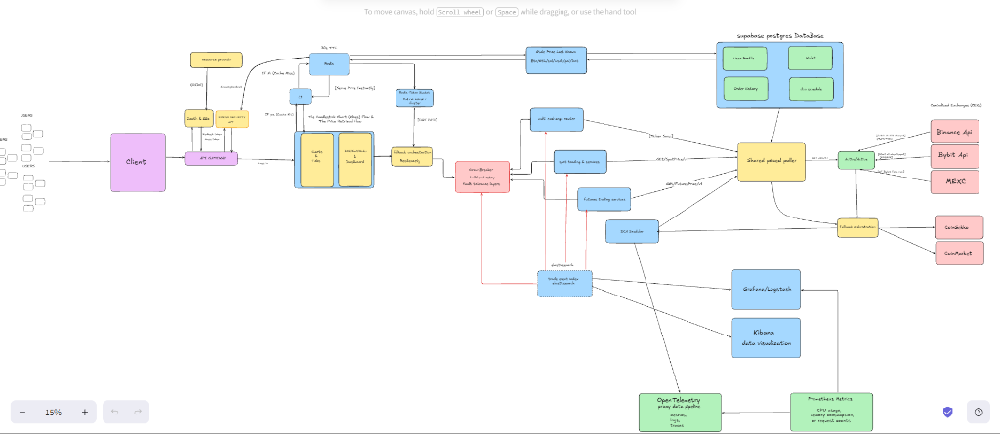

# NexTradeX Mock Trading Platform

**IMPORTANT:** This platform is for educational, simulation, and demonstration purposes only. No real money, assets, or live trading is involved. All trades, balances, and market data are simulated.

- No real deposits, withdrawals, or asset transfers are possible.
- All trading activity is virtual and has no financial value.
- Do not use this platform for real investment or trading decisions.

## Disclaimer
NexTradeX is a mock trading environment. The developers and maintainers are not responsible for any financial decisions made based on simulated results.

---

## Key Features

The platform provides a range of mock trading capabilities, integrations, and developer tools for learning and testing:

*   **Diverse Trading Types**: Support for Spot, Margin, Futures, Options, and Dollar-Cost Averaging (DCA) order placement with simulated order books.
*   **External Exchange Integrations**:
    *   **Binance integration** for real-time market data.
    *   **Multi-Exchange Failover Service** failing over to **Bybit** and **MEXC** during API cooldowns or rate-limits.
*   **Token-Bucket Rate Limiting**: Redis-backed API rate limiting on controllers using atomic Lua scripts (fail-safe enabled).
*   **Prometheus & Grafana Monitoring**: Full containerized monitoring setup scraping Spring Actuator metrics.
*   **Secure Authentication**: JWT-based login/registration alongside Google OAuth2 integration with robust CORS configurations.
*   **Account & Wallet Management**: Virtual multi-currency wallets with configurable balances, transfers, deposits, and resets.
*   **Real-time Updates**: WebSocket integration using STOMP to broadcast price alerts, market ticks, and order status events.
*   **Advanced Charts**: Interactive candlestick charts using the Lightweight Charts library.
*   **Modern Frontend**: Responsive, responsive-designed UI using React 18, Tailwind CSS, and Lucide React.

---

## System Architecture

The following diagram illustrates the high-level architecture and request-flow routing within the NexTradeX platform, showing integrations with Redis rate limiting, external exchange endpoints (Binance, Bybit, MEXC) with active/inactive routing, database structure, and the OpenTelemetry/Prometheus/Grafana telemetry pipeline:



A detailed description of the components shown in this diagram can be found in the [System Architecture Guide](file:///c:/Users/adity/OneDrive/Desktop/NexTradeX/docs/ARCHITECTURE.md).

---

## Technology Stack

| Layer | Technologies | Key Features |
| :--- | :--- | :--- |
| **Backend** | Spring Boot 3.3.0, Spring Security, Spring WebFlux | REST APIs, WebSocket (STOMP), IoC, SpringDoc (Swagger) |
| **Database** | In-Memory H2, PostgreSQL, Spring Data JPA | Relational data persistence (H2 for development/testing, PostgreSQL for production) |
| **Caching/Limiting** | Redis, StringRedisTemplate, Lua Scripting | Distributed rate limiting, Atomic token refilling |
| **Monitoring** | Spring Actuator, Micrometer, Prometheus, Grafana | App metrics, system health, scrapes on port 9090 & 3000 |
| **Frontend** | React 18, Vite, Tailwind CSS, Lightweight Charts | Component-based, lightning-fast HMR, modular UI |
| **Testing** | JUnit 5, Spring Security Test, Integration Tests | Mock MVC testing, RedisRateLimiter unit testing |

---

## Prerequisites & Setup

### Prerequisites
*   **Java 17+** & Maven installed on your system path.
*   **Node.js 18+** & npm (or yarn) for running the React frontend.
*   **Docker** (for monitoring and local Redis services, optional but recommended).
*   **Redis 6+** running locally (or via Docker) for rate limiting.

### Quick Start Guide

#### 1. Setup Environment
Copy the example environment file and configure variables:
```bash
cp .env.example .env
```
Ensure you update the configuration settings (such as Redis connection details, database URLs, and API keys).

#### 2. Start Redis & Monitoring Services
If you have Docker running, launch Redis and the Prometheus/Grafana stack:
```bash
# Run a quick Redis container if you don't have local Redis
docker run -d --name nextrade-redis -p 6379:6379 redis:alpine

# Start Prometheus and Grafana
docker compose -f docker-compose-monitoring.yml up -d
```

#### 3. Start Backend
Run the Spring Boot application using Maven:
```bash
mvn spring-boot:run
```
The backend server runs on `http://localhost:8080/api` (Swagger UI is available at `http://localhost:8080/api/swagger-ui.html`).

#### 4. Start Frontend
Navigate to the frontend folder, install dependencies, and run the development server:
```bash
cd frontend
npm install
npm run dev
```
The frontend web app runs on `http://localhost:3000` (or `http://localhost:5173`).

---

## Authentication & OAuth2 Setup

NexTradeX supports credentials login as well as Google OAuth2.

### Google OAuth2 Credentials Configuration
To enable "Login with Google", define the following properties in your `.env` file:
```env
GOOGLE_CLIENT_ID=your-google-client-id
GOOGLE_CLIENT_SECRET=your-google-client-secret
OAUTH_REDIRECT_URI=http://localhost:8080/api/login/oauth2/code/google
FRONTEND_CALLBACK_URL=http://localhost:3000/auth
```

> [!NOTE]
> For detailed instructions on OAuth2 configuration, CORS, and credential settings, refer to the [OAuth2 Fix Quick Start](file:///c:/Users/adity/OneDrive/Desktop/NexTradeX/docs/README_OAUTH_FIX.md) and the [OAuth Fix Index Guide](file:///c:/Users/adity/OneDrive/Desktop/NexTradeX/docs/OAUTH_FIX_INDEX.md).

---

## Architecture & Key Services

For an in-depth breakdown of the main platform subsystems, including implementation specifics, configurations, and failover workflows, refer to the [System Architecture Guide](file:///c:/Users/adity/OneDrive/Desktop/NexTradeX/docs/ARCHITECTURE.md).

*   **Redis-Backed Token Bucket Rate Limiter**: Atomic token refilling using Redis Lua scripts with graceful fail-safe capabilities.
*   **Multi-Exchange Failover Service**: High-availability external price feeds routing across Binance, Bybit, and MEXC API endpoints.
*   **Monitoring System**: Prometheus metrics collection scraped via Actuator `/api/actuator/prometheus` coupled with Grafana dashboards.

---

## Project Structure

```
NexTradeX/
├── src/main/java/com/NexTradeX/
│   ├── auth/           # Native JWT auth and controller
│   ├── binance/        # Binance service, websocket, and multi-exchange failover
│   ├── common/         # Common DTOs, API responses, health, notifications, and annotation interfaces
│   ├── config/         # Spring configs (CORS, JWT, Redis, Interceptors, WebSockets, OpenAPI)
│   ├── dto/            # Data transfer objects (Orders, DCA, Wallets, etc.)
│   ├── exception/      # Global exception handling
│   ├── futures/        # Futures trading and position controllers
│   ├── margin/         # Margin trading, leverage controls, and positions
│   ├── market/         # Live prices, candlestick charts, price alert controllers
│   ├── oauth/          # Google OAuth2 callbacks and profile completion
│   ├── options/        # Options contract purchases and settlement
│   ├── order/          # Spot order books, fill engines, and DCA schedules
│   ├── risk/           # Risk controls and leverage calculation engines
│   ├── user/           # User profile and watchlist controllers
│   └── wallet/         # Multi-wallet ledger service (Spot, Margin, Futures)
│
├── docs/               # Technical manuals, API references, architecture guides
│
├── frontend/           # React application built with Vite and Tailwind
│   ├── src/
│   │   ├── pages/      # Page components (Dashboard, Spot, Margin, Futures, OAuth Auth)
│   │   ├── components/ # Reusable UI components
│   │   ├── api.js      # CORS credentials & API fetch wrapper
│   │   └── App.js      # React application router
│   └── package.json
│
├── docker-compose-monitoring.yml # Monitoring container definitions (Grafana, Prometheus)
├── prometheus.yml                # Prometheus scraping configurations
└── README.md
```

---

## API Endpoints

A complete mapping of all REST endpoints exposed by the backend services is detailed in the [API Endpoints Reference Guide](file:///c:/Users/adity/OneDrive/Desktop/NexTradeX/docs/API_ENDPOINTS.md).

---

## Contributing

Contributions are welcome! Please open issues or submit pull requests for bug fixes, performance updates, or new simulation engines:
1. Fork the project.
2. Create a feature branch (`git checkout -b feature/NewFeature`).
3. Commit your changes (`git commit -m 'Add NewFeature'`).
4. Push to the branch (`git push origin feature/NewFeature`).
5. Open a Pull Request.

Please follow standard Java/Maven formatting configurations, and add unit/integration tests for any added business logic.

---

## License

This project is open-source and intended solely for educational/simulation purposes. All rights reserved.


https://foglamp.dev/scan/nextradex-knbxwi