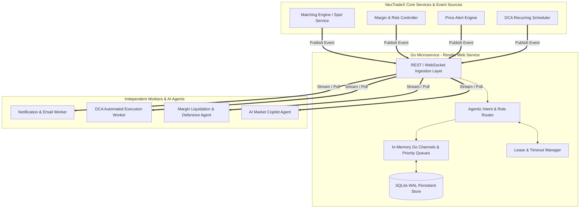

# 🚜 Bulldozer MQ (Agentic Edition) — Pure Architectural Theory & Engineering Blueprint

This specification is a dedicated technical masterclass and architectural reference for building **Bulldozer MQ**: a lightweight, high-performance, **Agentic Message Queue** implemented in **Go (Golang)**.

---

## 1. System Architecture & Core Philosophy

Traditional message queues (RabbitMQ, Kafka, SQS) treat messages as "dumb bytes" or plain text strings. **Bulldozer MQ** introduces **Agent-Awareness** and **Intent-Based Routing** directly into the queueing engine layer.

### 1.1 High-Level System Topology



### 1.2 Architectural Principles
* **Microservice Isolation**: Bulldozer MQ runs as an independent Go process. If the main web backend crashes or restarts, Bulldozer MQ safely holds all pending event tasks in queue.
* **Zero Infrastructure Bloat**: Operates as a single static binary requiring zero heavy dependencies (No Java JVM runtime, No Erlang runtime, No ZooKeeper/KRaft cluster).
* **Render Cloud Optimization**: Runs in ~15MB to 25MB RAM, fully utilizing Render's 512MB free tier while supporting tens of thousands of messages per second.

---

## 2. Core Operational Mechanics & Internal Engine Theory

### 2.1 The Message Lifecycle & Lease State Machine

```
[ Producer ]
     │
     ▼ 1. Enqueue Message
[ Ingestion Layer ] ──(Assign UUID, Priority, Status: PENDING)
     │
     ├──> 2a. Write to SQLite WAL Store (Durability)
     └──> 2b. Push to Go Channel (In-Memory Priority Queue)
               │
               ▼ 3. Dispatch Task to Worker Agent
           [ Status: PROCESSING ] (Lease Timer Starts: e.g., 30s)
               │
       ┌───────┴────────────────────────┐
       ▼ (Success)                      ▼ (Worker Crashes / Times out)
 4a. Worker sends ACK             4b. Lease Expires
       │                                │
 Status: SETTLED                  Retry Count ++
 (Archived / Purged)              Status Reset to PENDING
                                        │
                                        ├── (Retry < MaxRetries) ──> Re-enqueued
                                        └── (Retry >= MaxRetries) ──> Moved to DLQ
```

### 2.2 Intent & Role-Based Routing Theory
Instead of routing strictly by topic string (e.g. `order-events`), Bulldozer MQ routes by **Agent Capability & Business Intent**:
1. **Role Targeting (`TargetAgentRole`)**: Message specifies which class of worker should process it (e.g. `NOTIF_AGENT`, `DCA_WORKER`, `RISK_AGENT`).
2. **Intent Filtering (`Intent`)**: Workers filter tasks by semantic intent (e.g., `ORDER_FILLED`, `MARGIN_LIQUIDATION_WARNING`, `EXECUTE_DCA`).
3. **Broadcast Fan-Out**: If `TargetAgentRole == "*"`, the router duplicates the message across all consumer groups listening on that topic.

### 2.3 Priority Queuing Logic (Go Select Locks)
Bulldozer MQ maintains multi-tiered Go channels per topic evaluated via non-blocking Go `select` statements:

* **High-Priority Channel (Priority 8 – 10)**: Critical financial triggers (Margin Liquidations, Stop-Loss Fills).
* **Normal-Priority Channel (Priority 1 – 7)**: Routine notifications, audit logs, and marketing alerts.

When an agent requests a task, the engine evaluates the High-Priority channel first. Critical risk events **always jump to the head of the queue**.

### 2.4 Lease Management & Dead Letter Queue (DLQ)
* **Lease Duration**: Each task dispatched receives a lease period (e.g. 30 seconds). The worker must finish and issue an `ACK` before the lease expires.
* **Fault Recovery**: If a worker node crashes mid-task, Bulldozer MQ detects the expired lease, resets the message status back to `PENDING`, and re-assigns it to another available worker.
* **Dead Letter Queue (DLQ)**: If a message fails or times out 3 times in a row, it moves to the `DLQ` channel to prevent poison-pill loops from blocking the pipeline.

---

## 3. Data Model & Engine State Specifications

### 3.1 Envelope Data Schema (`AgentMessage`)

The core engine communicates using an **Intelligent Message Envelope**:

* **`ID`** *(String)*: Unique identifier UUID (e.g. `bmq_98234719283`).
* **`Topic`** *(String)*: Event channel category (e.g. `trade-events`, `system-alerts`).
* **`TargetAgentRole`** *(String)*: Target worker role (e.g. `NOTIF_AGENT`, `RISK_BOT`, `DCA_WORKER`).
* **`Intent`** *(String)*: Semantic business action (e.g. `ORDER_FILLED`, `MARGIN_CALL`, `EXECUTE_DCA`).
* **`Priority`** *(Integer 1-10)*: Task urgency rating.
* **`Payload`** *(Key-Value Object)*: Domain event body data.
* **`Metadata`** *(Object)*:
  * **`CorrelationID`**: Trace ID tracking multi-agent execution chains.
  * **`SenderAgentID`**: Source service identifier.
* **`Status`** *(Enum)*: `PENDING`, `PROCESSING`, `SETTLED`, `DLQ`.
* **`RetryCount`** / **`MaxRetries`** *(Integer)*: Execution attempt trackers (default: 3 retries).
* **`TimeoutSec`** *(Integer)*: Worker lease duration in seconds.

### 3.2 In-Memory Concurrency Model
* **Go Goroutines**: Each incoming HTTP/WS request runs in an isolated, lightweight goroutine (~2.5 KB RAM per connection).
* **Go Channels**: Lock-free in-memory message queues per topic (`chan AgentMessage`).
* **Thread-Safety**: Uses `sync.RWMutex` for safe concurrent state mutation across parallel worker routines.

### 3.3 Persistence Engine (SQLite WAL Mode)
* **Write-Ahead Logging (WAL)**: SQLite in WAL mode permits concurrent reads while writes are flushed sequentially.
* **Durability Guarantee**: Messages are written to SQLite before being pushed to Go channels, ensuring zero message loss across container restarts.

---

## 4. Architectural Comparison: Bulldozer MQ vs. Industry Standard MQs

| Architectural Dimension | 🔴 **Redis Pub/Sub** | 🟠 **RabbitMQ** | 🟡 **Apache Kafka** | 🟢 **Bulldozer MQ (Go Engine)** |
| :--- | :--- | :--- | :--- | :--- |
| **Primary Design Target** | Ultra-fast in-memory caching & pub/sub | Enterprise AMQP task queuing & exchanges | High-throughput distributed log streaming | Agentic Intent & Role Task Dispatch |
| **Runtime & Dependencies** | C engine (Separate service) | Erlang VM (Requires RabbitMQ server) | JVM (Requires Java, ZooKeeper/KRaft cluster) | **Single Go Static Binary (~15MB)** |
| **Memory Footprint** | Low (~30MB) | Moderate (~150MB - 300MB) | Heavy (~1GB+ JVM Heap) | **Ultra-Low (~15MB RAM)** |
| **Message Persistence** | ❌ None (Fire-and-forget; lost if offline) | ✅ Durable disk queues | ✅ Immutable append-only commit logs | ✅ Embedded SQLite WAL store |
| **Routing Paradigm** | Channel string matching | AMQP exchanges & routing keys | Topic partitions & key hashes | **Native `Intent` & `TargetAgentRole` matching** |
| **Lease & Ack Management** | ❌ None | ✅ Manual / Auto ACK | ✅ Offset commit tracking | ✅ Built-in Lease Timer & Automatic DLQ |
| **Setup Complexity** | Zero (If Redis already running) | Moderate (Server config & management) | High (Cluster config, topics, partitions) | **Minimal (Deploy single Go container on Render)** |

### Deep Dive Comparison Takeaways:
1. **Why NOT Redis Pub/Sub for Tasks?** Redis Pub/Sub has no persistent queue. If a worker goes offline for 2 seconds, all trade notifications fired during those 2 seconds are **lost forever**.
2. **Why NOT RabbitMQ for Render Free Tier?** RabbitMQ runs on Erlang, consuming 150MB+ RAM just idle. On Render's 512MB RAM cap, this starves your main trading app.
3. **Why NOT Apache Kafka?** Kafka requires a multi-node JVM cluster, designed for millions of events per second across corporate data centers. For a paper trading platform, Kafka is extreme over-engineering.
4. **Why Bulldozer MQ Wins Here**: Delivers RabbitMQ-style durable task queuing and lease recovery in a tiny 15MB Go binary with native Agent Intent routing.

---

## 5. Overall System Capacity & Scale Tier Performance Analysis

```
  [ React Frontend ] (Vite / CDN)  ──>  [ Spring Boot Backend ]  ──>  [ PostgreSQL DB ]
                                              │                               │
                                      [ Redis Cache ]               [ Bulldozer MQ (Go) ]
```

### 5.1 System Capacity Matrix Across Deployment Tiers

| Scale Metric | 🥉 Free Tier (Render Free: 512MB RAM) | 🥈 Starter Prod (1 Server: 4GB RAM, 2 vCPU) | 🥇 Scaled Enterprise (Multi-Node + Read Replicas) |
| :--- | :--- | :--- | :--- |
| **Concurrent Active Users (Online)** | **500 – 1,200 users** | **5,000 – 10,000 users** | **50,000 – 100,000+ users** |
| **Order Execution Speed** | **150 – 300 orders/sec** | **1,500 – 3,000 orders/sec** | **20,000+ orders/sec** |
| **WebSocket Price Tick Delivery** | **2,000 updates/sec** | **25,000 updates/sec** | **250,000+ updates/sec** |
| **Supported Daily Active Users (DAU)** | **10,000 – 25,000 DAU** | **150,000 – 300,000 DAU** | **1,000,000+ DAU** |

### 5.2 Component-by-Component Performance Limits

1. **Frontend (React + Vite SPA)**:
   * *Limit*: **UNLIMITED**
   * *Reason*: Built to static HTML/JS assets served via CDNs (Vercel / Cloudflare Pages).
2. **Redis Rate Limiter & Token Storage**:
   * *Limit*: **100,000+ requests/sec**
   * *Reason*: Sub-millisecond lookups for rate limiting and password reset token storage.
3. **Java Spring Boot Backend**:
   * *Limit*: **300 to 3,000 API requests/sec per instance**
   * *Reason*: Handles JWT auth, order validation, and DB transactions.
4. **PostgreSQL Database (The Main Bottleneck)**:
   * *Limit*: **100 to 500 ACID write transactions/sec (Free DB)**
   * *Reason*: `@Transactional` row locking on user wallets and order creation.
   * *Mitigation*: Connection pooling (HikariCP), Redis read-caching, and read-replicas.
5. **Bulldozer MQ (Go Service)**:
   * *Limit*: **15,000 to 30,000 msg/sec**
   * *Reason*: Asynchronous background processing isolated in Go channels.

### 5.3 Failure Cascade Chain & Bottleneck Resolution

Under extreme market volatility (e.g. Bitcoin crash with 50,000 simultaneous logins):
1. **Database Connection Pool Exhaustion (First Failure Point)**: HikariCP pool fills up. *Fix*: Enable Redis Read-Caching for non-transactional GET queries.
2. **Spring Boot JVM Memory Pressure (Second Failure Point)**: High thread concurrency fills Java heap. *Fix*: Spin up a second Spring Boot instance on Render behind Render's native load balancer.

---

## 6. Engine Construction Blueprint & Package Structure

### 6.1 Go Repository Layout (`bulldozer-mq/`)
```
bulldozer-mq/
├── cmd/
│   └── server/
│       └── main.go           # Entry point: initializes DB, engine, & starts HTTP/WS server
├── config/
│   └── config.go             # Environment variable loader (PORT, BULLDOZER_KEY, DB_PATH)
├── internal/
│   ├── api/
│   │   ├── handlers.go       # REST endpoints (/publish, /consume, /ack, /health)
│   │   ├── middleware.go     # Security middleware (X-Bulldozer-Key verification)
│   │   └── websocket.go      # Real-time WebSocket task streaming engine
│   ├── engine/
│   │   ├── manager.go        # In-memory Go Channel & Priority Queue manager
│   │   └── router.go         # Intent & Role capability router
│   ├── models/
│   │   └── message.go        # AgentMessage & AgentMetadata domain structs
│   ├── store/
│   │   ├── sqlite.go         # SQLite WAL mode initialization & SQL operations
│   │   └── store.go          # Persistence interface
│   └── worker/
│       └── lease.go          # Background goroutine for lease timeouts & DLQ eviction
├── db/
│   └── schema.sql            # Table definitions & performance indexes
├── Dockerfile                # Multi-stage Alpine container build (~15MB binary)
├── go.mod
└── go.sum
```

### 6.2 Mandatory Development Checklist
- [x] Enable SQLite WAL mode (`PRAGMA journal_mode=WAL;`).
- [x] Configure UptimeRobot 5-minute health check ping targeting `GET /api/v1/health` to keep Render free service awake.
- [x] Implement non-blocking `@Async` HTTP publisher client in Java backend.
- [x] Implement consumer idempotency checking (tracking processed `message_id`s) to prevent duplicate execution on lease retries.